# Guia de Estudio: Comunicacion Indirecta en Sistemas Distribuidos

## 1. Objetivo de esta guia
Esta guia convierte la Presentacion 3 en un material de estudio autocontenido para entender, analizar y aplicar:
- Comunicacion indirecta.
- Comunicacion grupal y ordenamiento de mensajes.
- Publicacion-suscripcion.
- Colas de mensajes.
- JMS y uso de ActiveMQ.

La meta no es simplificar en exceso, sino conservar la complejidad tecnica del tema y organizarla para estudio serio.

## 2. Mapa conceptual general
La comunicacion indirecta aparece cuando dos procesos no se comunican "cara a cara", sino mediante infraestructura intermedia (broker, cola, topic, bus de eventos, memoria compartida distribuida).

Esa indirecta resuelve problemas de acoplamiento, pero introduce decisiones de diseno:
- Que garantias de entrega y orden necesito.
- Que latencia y costo operacional acepto.
- Si necesito uno-a-uno (queues) o uno-a-muchos (topics/multicast).
- Si quiero centralizacion (mas simple) o distribucion (mas robusta/escalable).

## 3. Fundamentos: que significa "indirecta"

### 3.1 Definicion operativa
Comunicacion indirecta es un esquema donde emisor y receptor no se conocen ni dependen directamente el uno del otro para intercambiar informacion.

### 3.2 Desacoplamiento espacial
El productor no necesita conocer la identidad del consumidor, ni su direccion concreta, ni su ubicacion.

Implicacion de arquitectura:
- Puedes reemplazar, migrar, replicar o escalar consumidores sin tocar el productor.

### 3.3 Desacoplamiento temporal
Productor y consumidor no necesitan estar activos al mismo tiempo.

Implicacion de arquitectura:
- El middleware retiene/enruta mensajes y permite independencia de tiempos de vida.

### 3.4 Costo de la flexibilidad
La presentacion remarca un punto clave: mayor adaptabilidad suele traer mayor retraso y mayor complejidad de operacion/observabilidad.

## 4. Memoria distribuida compartida (DSM)
La presentacion incluye la abstraccion de memoria compartida distribuida como modelo de intercambio indirecto.

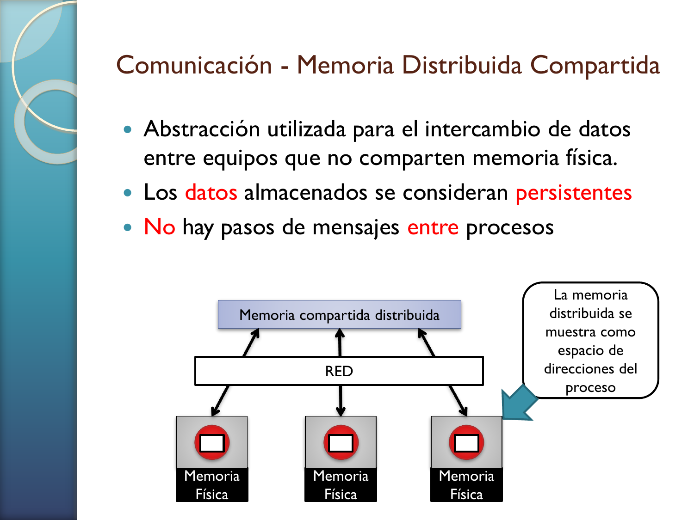

**Lectura tecnica del diagrama**:
- Varias memorias fisicas estan conectadas por red.
- Encima, el sistema ofrece la ilusion de un espacio de memoria compartido.
- Para el proceso, la memoria parece unificada aunque fisicamente este distribuida.

**Idea profunda**:
- DSM intenta mover la complejidad al runtime/middleware para ocultar la distribucion.
- El reto real es mantener coherencia/consistencia y rendimiento bajo concurrencia y fallos.

## 5. Comunicacion grupal
Comunicacion grupal = envio de mensajes a un conjunto de miembros, no a un receptor individual.

### 5.1 Casos donde aporta valor
- Difusion fiable a muchos clientes.
- Aplicaciones colaborativas (estado compartido visible para todos).
- Replicacion con coherencia.
- Monitorizacion distribuida.

### 5.2 Tipos de grupo
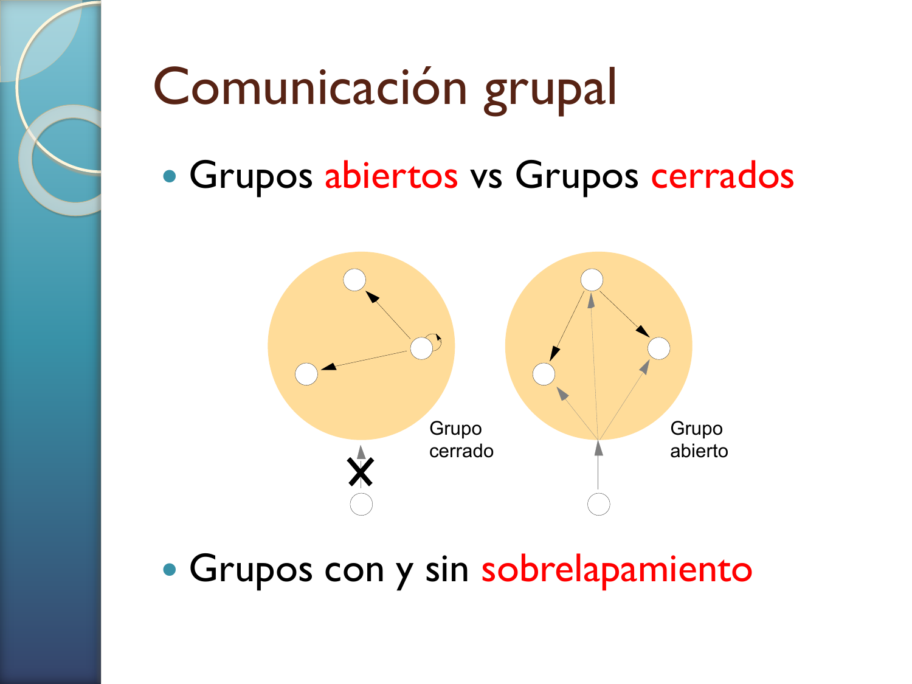

**Lectura tecnica del diagrama**:
- Grupo cerrado: membresia controlada/limitada.
- Grupo abierto: mas flexible en acceso/publicacion.
- Puede existir solapamiento entre grupos.

**Preguntas de diseno**:
- Quien puede publicar.
- Quien puede suscribirse.
- Como se autentica/autorizan miembros.

### 5.3 Fiabilidad en multicast
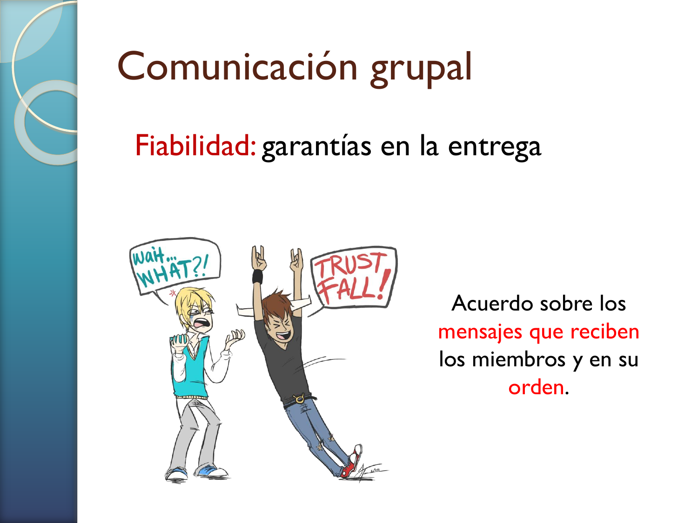

El acuerdo entre miembros no solo trata de "entrego o no entrego", sino de que todos construyan una historia compatible de mensajes recibidos.

Propiedades presentadas:
- **Integridad**: no se altera el mensaje.
- **Validez**: lo enviado eventualmente se entrega.
- **Acuerdo**: si uno lo entrega, todos los miembros relevantes lo entregan.

## 6. Ordenamiento de mensajes: Total, FIFO y Causal
Este bloque es central para examen y para diseno real de SD.

### 6.1 Orden total
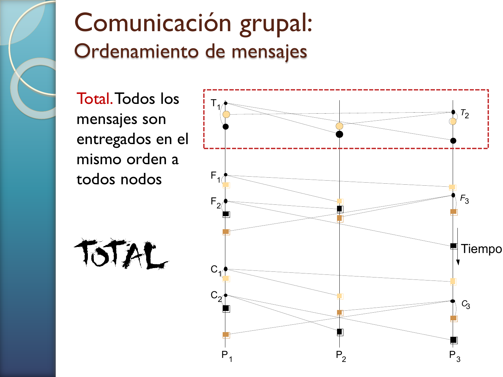

Todos los procesos observan exactamente el mismo orden global.

**Ventaja**:
- Simplifica razonamiento de estado replicado.

**Costo**:
- Mayor coordinacion y potencial mayor latencia.

### 6.2 Orden FIFO
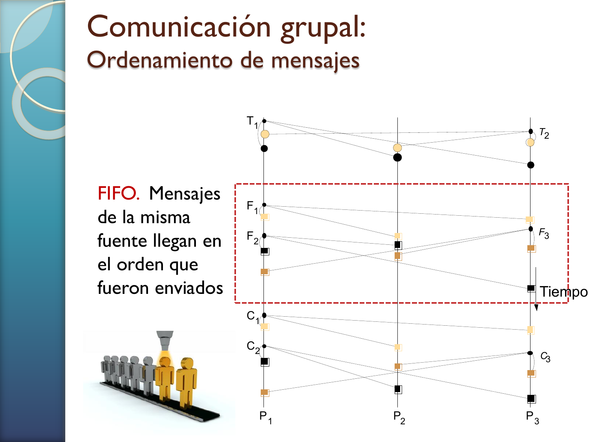

Se conserva el orden por emisor, pero no obliga orden global entre emisores.

**Ventaja**:
- Menos costo que total order.

**Riesgo**:
- Dos consumidores pueden ver distinto intercalado entre fuentes diferentes sin violar FIFO.

### 6.3 Orden causal
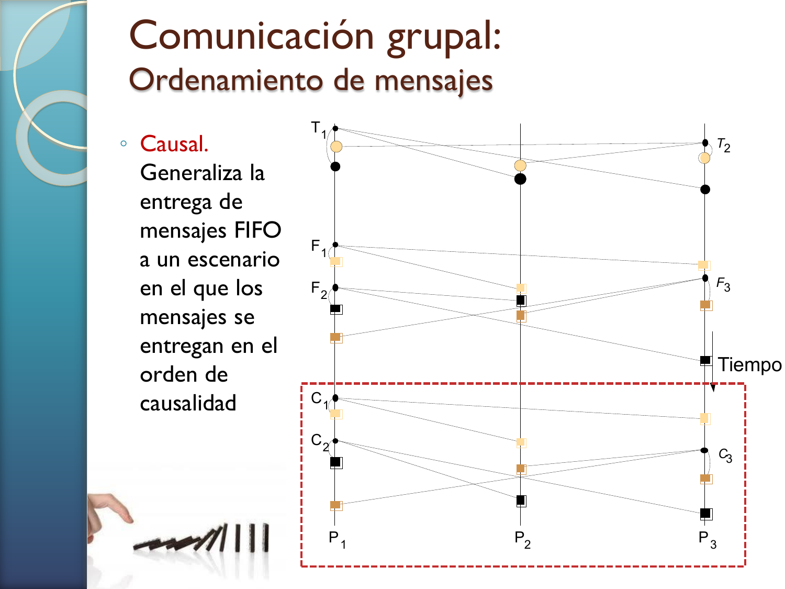

Respeta relaciones causa-efecto entre mensajes.

**Ejemplo mental**:
- Si `m2` depende de informacion de `m1`, no debe entregarse `m2` antes de `m1` a un mismo observador.

**Punto clave**:
- Causal suele ser un buen compromiso: mas fuerte que FIFO, menos estricto que total.

## 7. Manejo de membresia y fallos
La comunicacion grupal necesita infraestructura de control:
- Servicio de pertenencia al grupo.
- Detector de fallos.
- Notificacion de cambios de miembros.
- Expansion/resolucion de direcciones.

Sin eso, no hay base estable para garantizar acuerdo y orden cuando los nodos entran/salen o fallan.

## 8. Publicacion-suscripcion (pub-sub)

### 8.1 Modelo
- Editores publican eventos.
- Suscriptores declaran interes por filtros.
- El servicio hace matching y notifica.

### 8.2 Topologia de intermediacion
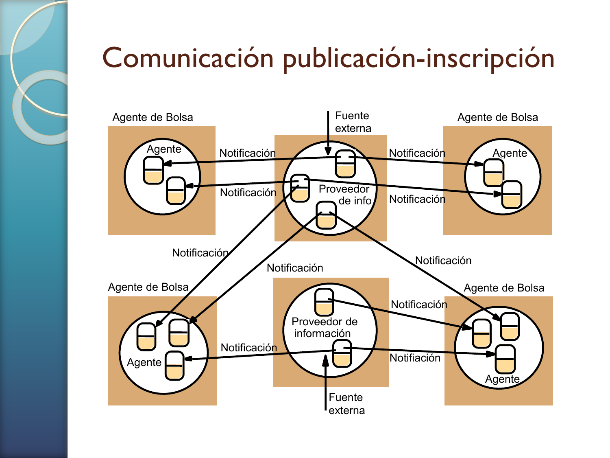

**Lectura tecnica del diagrama**:
- Se observan multiples agentes y fuentes externas.
- Las notificaciones atraviesan brokers/agentes de bolsa.
- Productores y consumidores quedan desacoplados en identidad y tiempo.

### 8.3 Propiedades del modelo
- **Heterogeneidad**: integra componentes diversos via contrato de evento.
- **Asincronia**: notificacion no bloqueante para emisores y mayor independencia temporal.

### 8.4 Operaciones basicas
- `Publicar(evento)`
- `Suscribir(filtro)`
- `Anunciar(filtro)`
- `CancelarSuscripcion(filtro)`
- `Notificar(evento)`

### 8.5 Filtros
1. Por canal.
2. Por tema/asunto.
3. Por contenido (queries sobre atributos).
4. Por tipo/subtipo de evento.

**Lectura de arquitectura**:
- Mientras mas expresivo el filtro, mayor costo potencial de matching y mayor complejidad de indexado en broker.

## 9. Centralizado vs distribuido en pub-sub
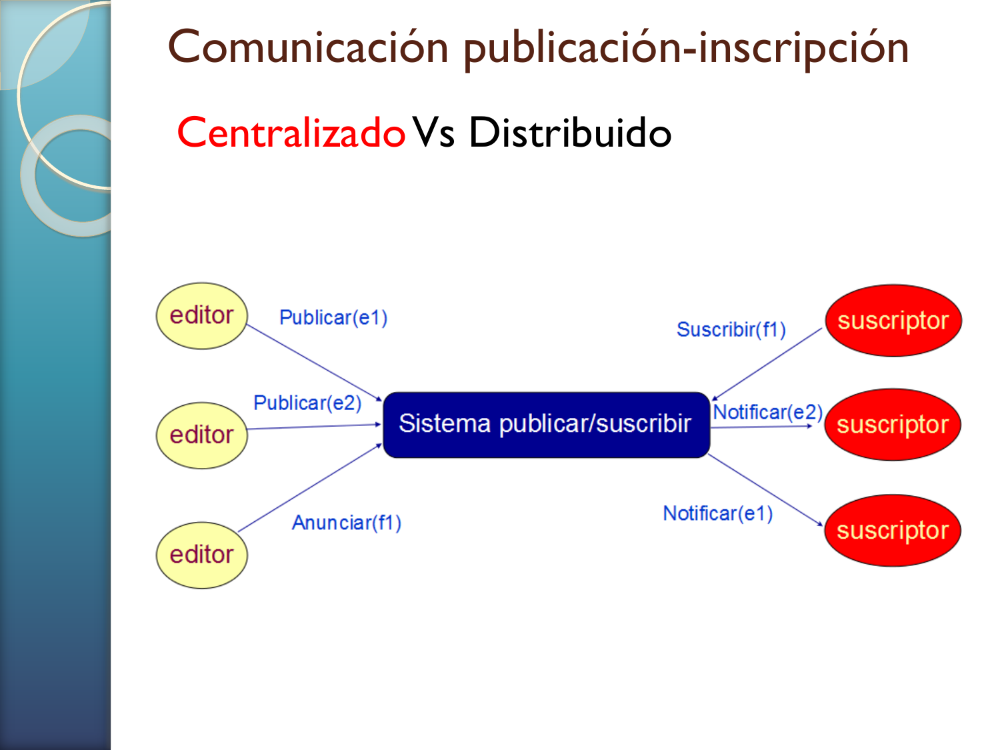
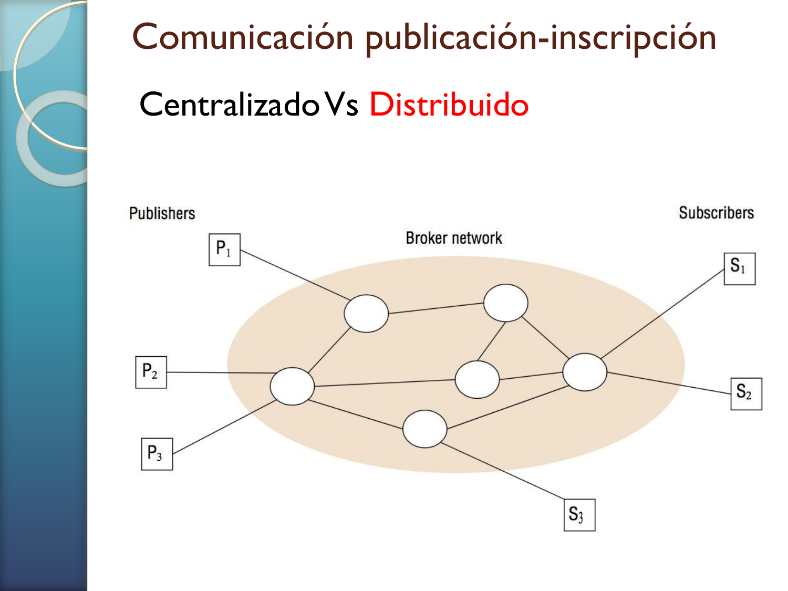

### 9.1 Broker centralizado
- Mas facil de administrar y observar.
- Riesgo de cuello de botella y punto unico de fallo.

### 9.2 Broker distribuido/federado
- Mayor escalabilidad y tolerancia a fallos.
- Mayor complejidad operativa (ruteo, consistencia de metadata, rebalanceo, recovery).

### 9.3 Regla practica
- Entorno pequeno o piloto: empezar centralizado.
- Requisitos de alta disponibilidad y escala: evolucionar a distribuido.

## 10. Colas de mensajes
Las colas sostienen el patron de trabajo asincrono uno-a-uno y la integracion desacoplada.

### 10.1 Propiedades relevantes
- Desacoplamiento espacial y temporal.
- Entrega tipicamente FIFO o por prioridad.
- Persistencia de mensajes.
- Seleccion por atributos.
- Integracion con transacciones.

### 10.2 Plataformas mencionadas

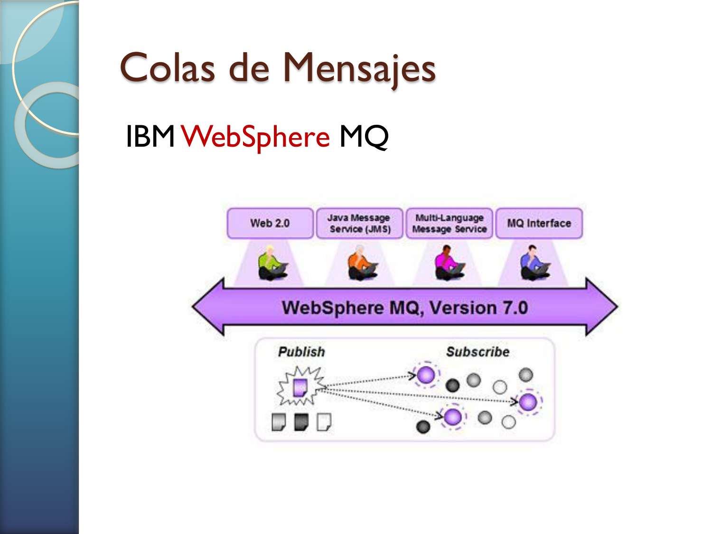
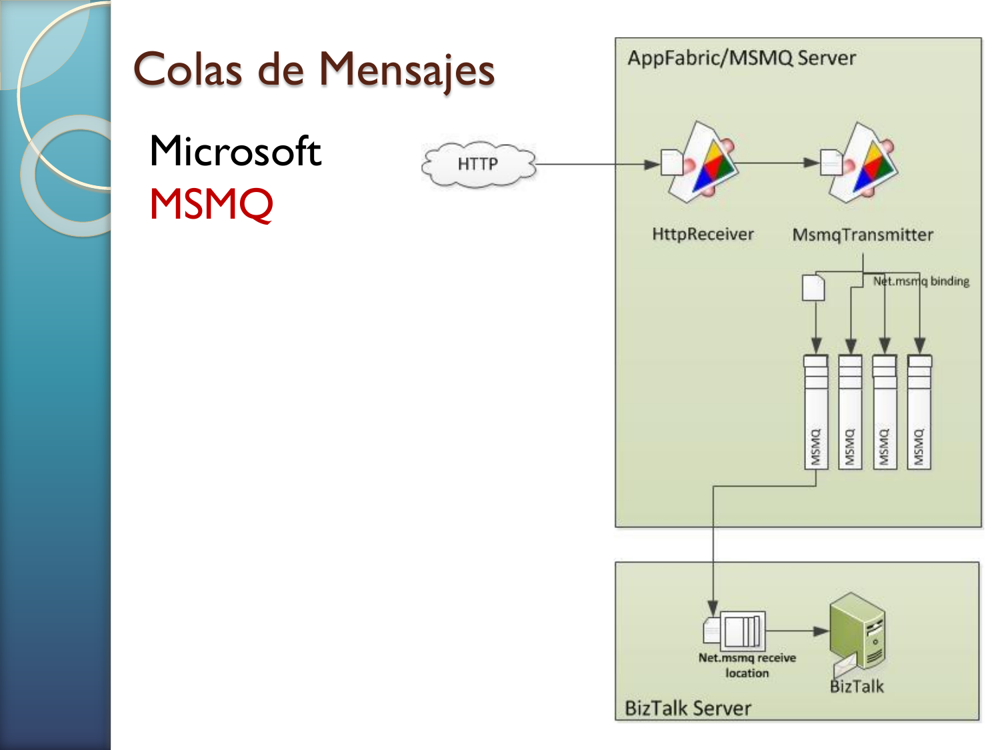
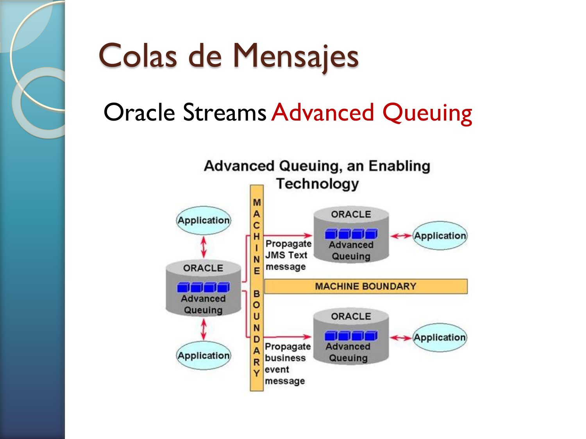

**Interpretacion**:
- La presentacion posiciona JMS como API estandar en Java, y muestra proveedores/plataformas del ecosistema empresarial.

### 10.3 Estilos de recepcion
- Bloqueante.
- No bloqueante.
- Basada en notificacion/listener.

**Impacto de diseno**:
- Bloqueante simplifica flujo pero consume hilos.
- No bloqueante reduce espera activa si se implementa bien.
- Listener facilita reaccion a eventos y alto throughput.

## 11. JMS (Java Message Service)

### 11.1 Que rol cumple JMS
JMS es una especificacion/API. El proveedor (por ejemplo ActiveMQ) implementa esa API.

### 11.2 Arquitectura conceptual
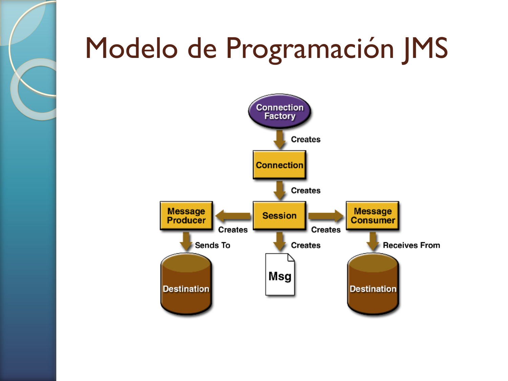

**Lectura tecnica del diagrama**:
- Un cliente obtiene una fabrica de conexiones.
- Crea conexion y sesion.
- Publica o consume en destinos (`Queue` o `Topic`).
- El broker administra entrega, persistencia y enrutamiento.

### 11.3 JNDI
Se usa para resolver objetos administrados (connection factories y destinos) por nombre.

### 11.4 Dos modelos JMS que hay que dominar
- **Punto a punto (Queue)**:
  - Un mensaje tiene un consumidor efectivo.
  - Receptor confirma lectura.
  - Muy util para reparto de trabajo.
- **Publicacion-suscripcion (Topic)**:
  - Un mensaje puede llegar a multiples consumidores.
  - Ideal para difusion de eventos.

## 12. ActiveMQ: puesta en marcha y lectura critica
La presentacion sugiere:
- Instalar JDK 21.
- Descargar ActiveMQ.
- Ejecutar broker.
- Entrar a consola web (`http://localhost:8161`) con `admin/admin`.
- Agregar librerias necesarias al proyecto Java.

**Nota tecnica importante para Linux/macOS**:
- En lugar de `activemq.bat`, se usa normalmente script tipo `activemq` o `activemq.sh` segun distribucion.

## 13. Diferencias clave: Queue vs Topic (comparacion de examen)

| Criterio | Queue | Topic |
|---|---|---|
| Patron base | Work queue | Event broadcast |
| Consumidores por mensaje | 1 (efectivo) | 1..N |
| Caso tipico | Repartir tareas | Distribuir notificaciones |
| Escala natural | Workers competidores | Suscriptores independientes |
| Riesgo comun | Backlog sin consumir | Tormenta de eventos |

## 14. Practicas de laboratorio (resumen breve)
Las slides con icono de practica describen dos ejercicios:
- **Topics - Sistema financiero**: un proveedor publica noticias por categoria; agentes de bolsa suscritos reaccionan por severidad y termina por evento de fin de sesion.
- **Queues - Potato game**: jugadores intercambian objetos por colas; el estado temporal del objeto define perdida del juego; se enfatiza uso de `TextMessage` y `ObjectMessage`.

## 15. Errores conceptuales frecuentes
1. Creer que asincronia implica "sin garantias".
2. Confundir FIFO con orden total.
3. Asumir que pub-sub siempre escala mejor sin costo.
4. Diseñar sin politica de membresia/deteccion de fallos.
5. Ignorar observabilidad (colas, lag, retries, DLQ).

## 16. Guion de estudio recomendado
1. Dominar desacoplamiento espacial/temporal con ejemplos.
2. Estudiar propiedades de fiabilidad multicast.
3. Comparar orden total vs FIFO vs causal con escenarios.
4. Entender filtros en pub-sub y su costo.
5. Contrastar queue y topic en casos reales.
6. Revisar arquitectura JMS y rol del proveedor.
7. Simular en papel un flujo completo en ActiveMQ.

## 17. Preguntas de autoevaluacion (nivel alto)
1. Que garantias minimas necesitas para mantener consistencia de replicas y por que.
2. Cuando FIFO es insuficiente y necesitas causal o total order.
3. Como cambia el diseno si el broker central se cae.
4. Que estrategia usarias para evitar acumulacion infinita en colas.
5. Como justificar formalmente elegir `Topic` sobre `Queue` en un sistema financiero.

## 18. Cierre
La comunicacion indirecta no es solo un mecanismo de transporte; es una decision arquitectonica que define acoplamiento, resiliencia, rendimiento y mantenibilidad del sistema distribuido. Esta presentacion, leida a profundidad, muestra la progresion natural desde fundamentos teoricos (acoplamiento y orden) hasta implementacion concreta (JMS/ActiveMQ), incluyendo los compromisos reales de operacion que aparecen en sistemas de produccion.
