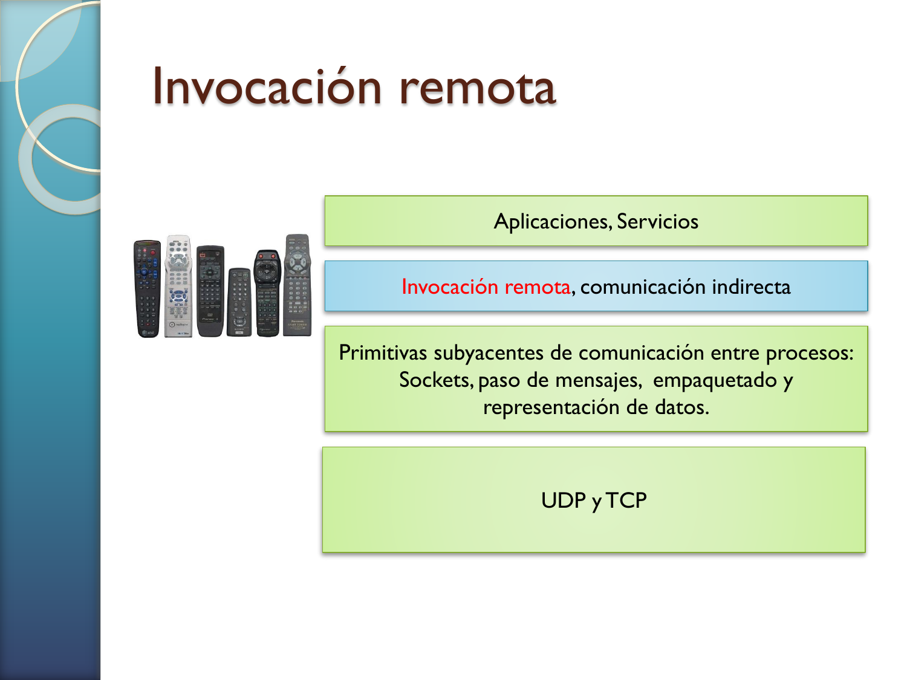
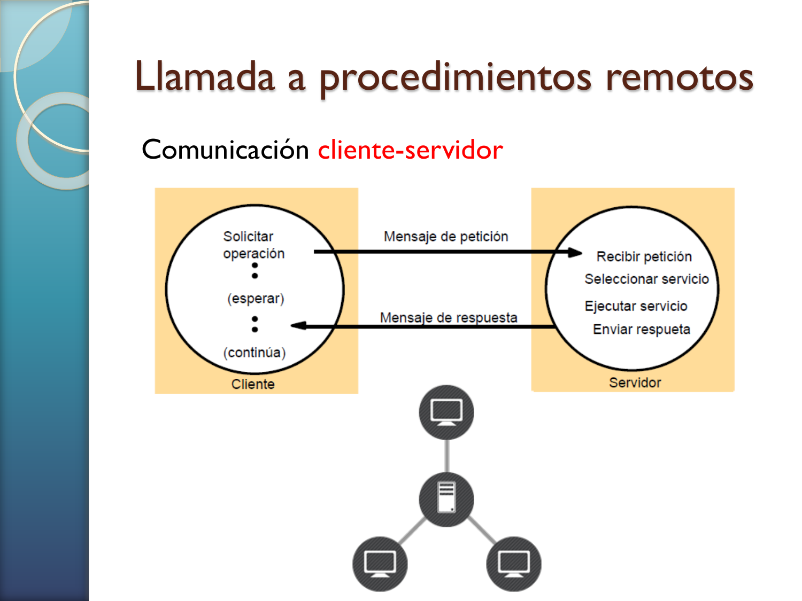
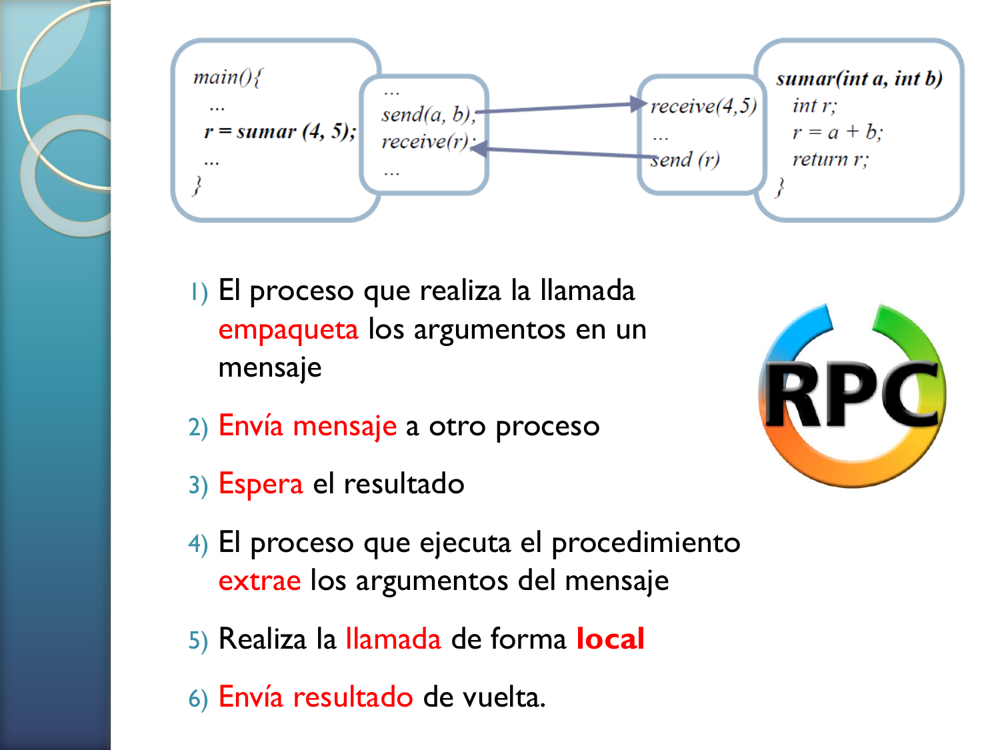
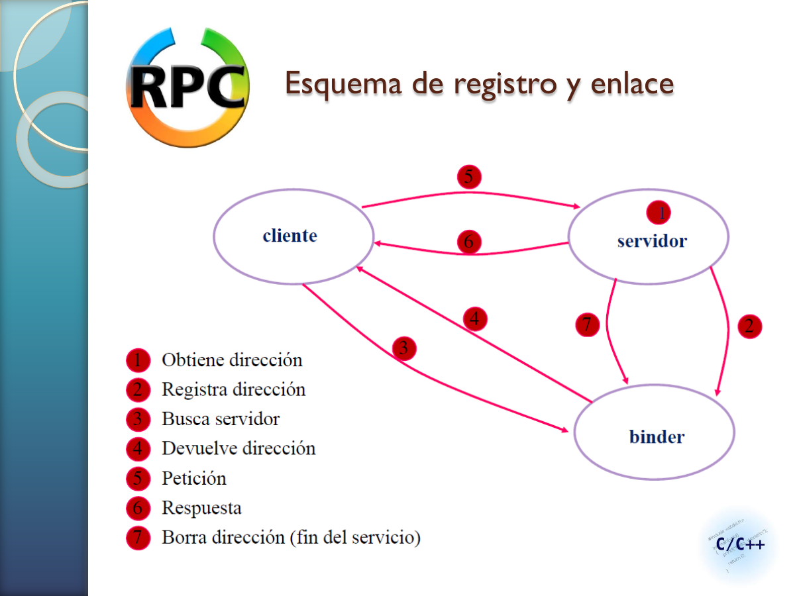
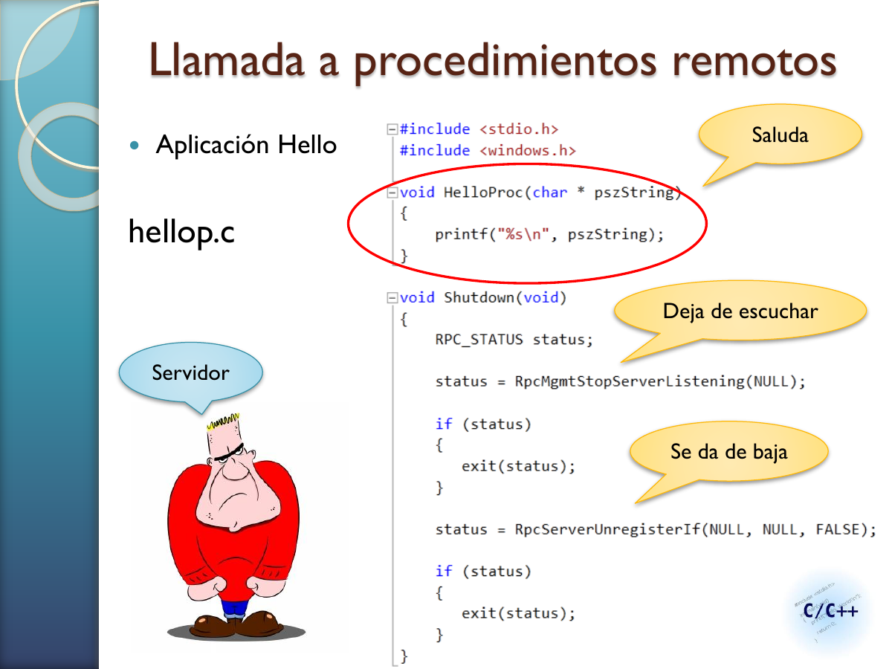
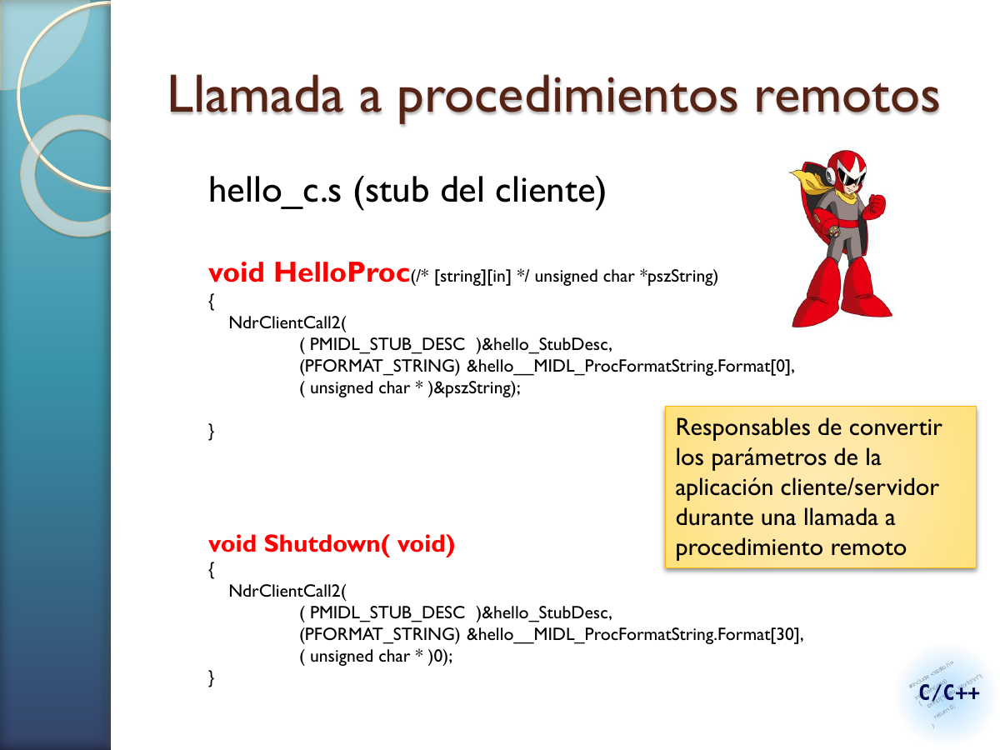
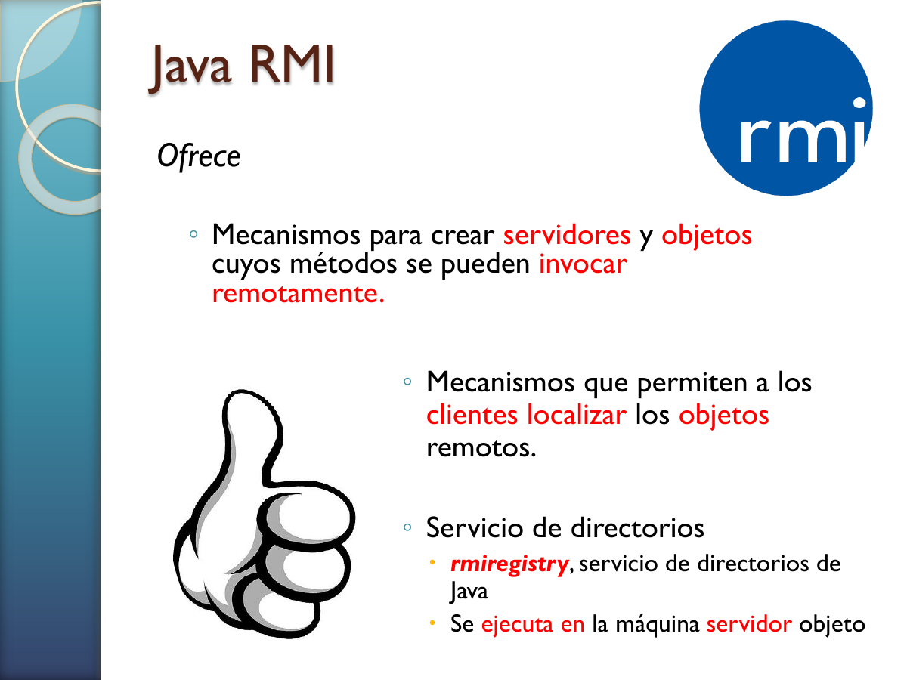
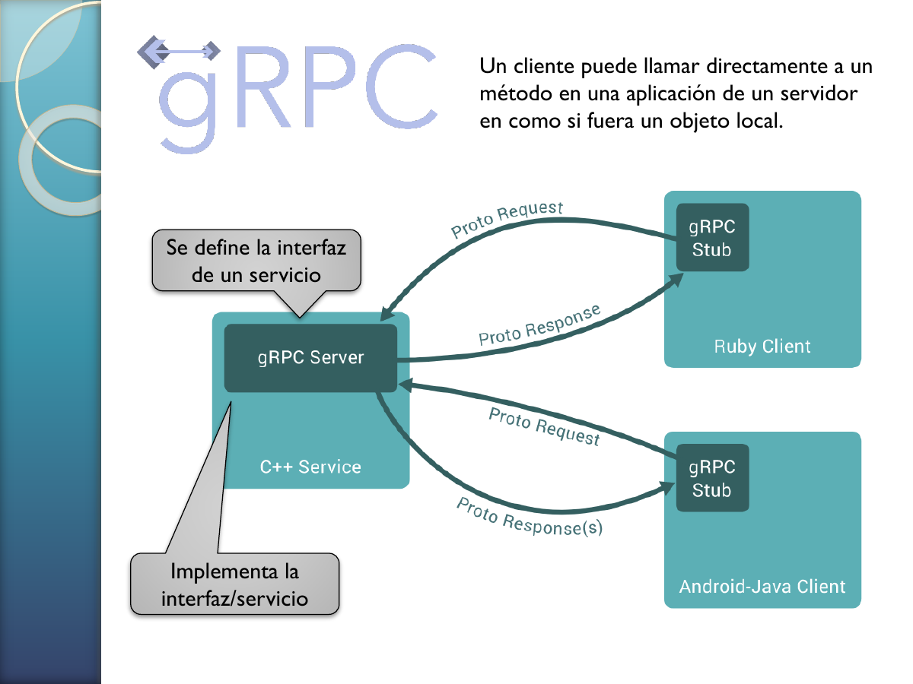
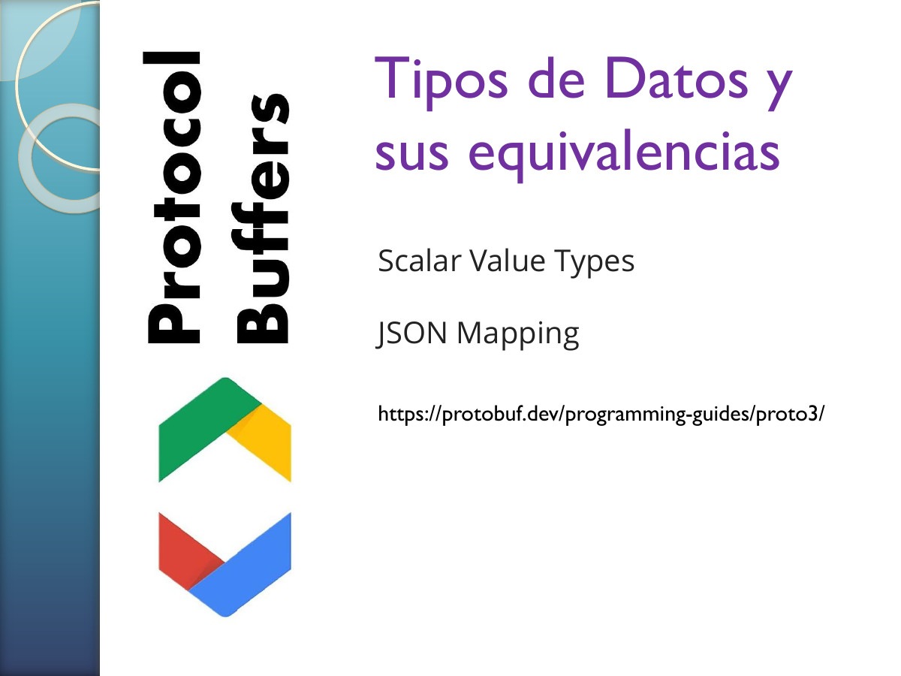
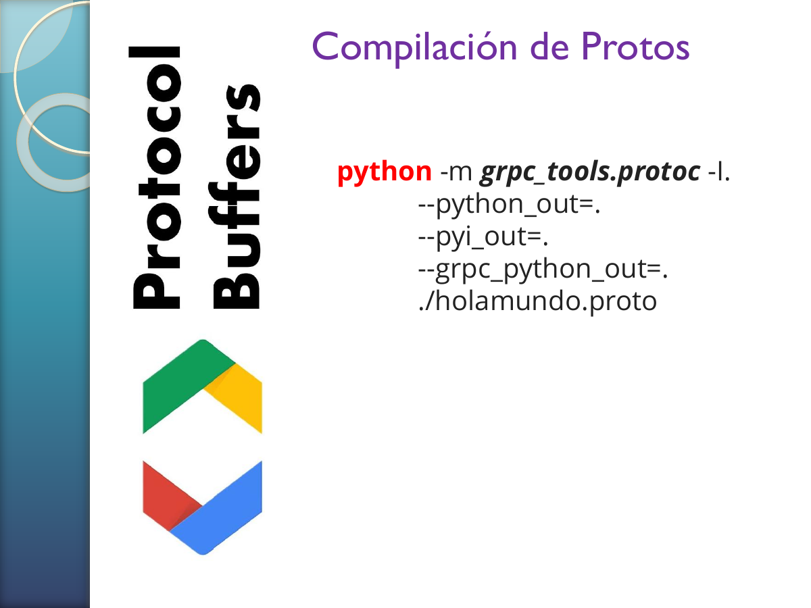

# Guia de Estudio: Invocacion Remota (RPC, RMI, gRPC y Protocol Buffers)

## 1. Objetivo de la guia
Esta guia convierte la presentacion de "Invocacion remota" en un material de estudio profundo y autocontenido para:
- Entender la base conceptual de RPC.
- Analizar el rol de interfaces, stubs y binding.
- Evaluar semanticas de fallo en llamadas remotas.
- Comparar RPC, RMI y gRPC.
- Comprender Protocol Buffers como contrato y serializacion.

El foco es conservar el nivel tecnico del material original, no simplificarlo en exceso.

## 2. Mapa del tema en sistemas distribuidos
La invocacion remota es una **abstraccion de alto nivel**: permite a una aplicacion invocar funcionalidad en otro proceso/nodo con sintaxis parecida a llamada local, ocultando detalles de red.

**Lectura tecnica del diagrama**:
- Capa superior: aplicaciones y servicios.
- Capa intermedia: mecanismos de invocacion remota e indirecta.
- Capa inferior: primitivas (sockets, paso de mensajes, empaquetado, UDP/TCP).

Interpretacion importante:
- A medida que subes en abstraccion, baja el control fino pero aumenta productividad y mantenibilidad.

## 3. RPC clasico: modelo y motivacion

### 3.1 Idea fundacional
RPC (Remote Procedure Call) busca que una llamada remota se parezca a una llamada local, con transparencia para el programador.

### 3.2 Roles en el modelo

- Cliente activo: invoca.
- Servidor pasivo: recibe, ejecuta y responde.

### 3.3 Secuencia operacional completa

Flujo real de una RPC:
1. Cliente serializa argumentos (marshalling).
2. Envia solicitud.
3. Queda en espera (en modelo sincrono clasico).
4. Servidor deserializa (unmarshalling).
5. Ejecuta procedimiento local.
6. Serializa resultado y responde.

Idea clave:
- Lo remoto siempre acaba siendo transporte + serializacion + ejecucion local remota.

## 4. Interfaces, IDL y generacion de stubs

### 4.1 Por que interfaces
En distribuidos, la interfaz es contrato entre cliente y servidor. Define:
- Nombre del servicio.
- Operaciones remotas.
- Parametros de entrada/salida.
- Tipos de datos.

### 4.2 IDL (Interface Definition Language)
IDL formaliza el contrato para generar codigo automaticamente:
- Stub cliente.
- Skeleton/dispatcher servidor.
- Tipos auxiliares.

### 4.3 Stubs como traductores
El stub convierte llamada local aparente en operacion de red real. Sin stubs, cada cliente/servidor tendria que codificar manualmente serializacion, protocolo y manejo de mensajes.

## 5. Binding (enlace) y servicio de nombres
RPC requiere localizar al servidor correcto antes de invocar.

**Lectura tecnica del diagrama**:
- Servidor registra su endpoint en binder.
- Cliente consulta binder para obtener referencia.
- Cliente invoca al endpoint obtenido.

Consecuencia arquitectonica:
- El binder desacopla nombre logico de direccion fisica.
- Permite evolucion operativa (migraciones, reinicios, cambios de puerto).

## 6. Ejemplo RPC "Hello" y ciclo de vida

El ejemplo muestra que una solucion RPC completa incluye:
- Definicion de interfaz (`.idl`).
- Cliente que crea binding e invoca.
- Servidor que registra, escucha y se desregistra al terminar.

Aspecto relevante para examen:
- El ciclo de vida del servicio (alta, escucha, baja) es parte de la semantica distribuida.

## 7. Codigo generado y llamada efectiva

El codigo generado encapsula llamadas a runtime RPC (por ejemplo `NdrClientCall2`) para transportar parametros y resultados.

Conclusiones tecnicas:
- El programador no llama directamente sockets.
- El runtime RPC gestiona empaquetado, envio y retorno.
- Interfaz estable + codigo generado reduce errores de interoperabilidad.

## 8. Fallos en RPC: donde se rompe la transparencia
Fallos tipicos presentados:
- Cliente no localiza servidor.
- Perdida de request.
- Perdida de reply.
- Falla de servidor tras recibir request.
- Falla de cliente tras enviar request.

Implicacion:
- No existe transparencia total ante fallos. Debes explicitar politicas de timeout, reintento, deduplicacion e idempotencia.

Pregunta central de diseno:
- Que semantica de invocacion buscas (at-most-once, at-least-once, etc.) segun riesgo de duplicados y costo de reejecucion.

## 9. RMI: RPC con orientacion a objetos

### 9.1 Que agrega RMI
- Objetos distribuidos con metodos remotos.
- Modelo de interfaces remotas OO.
- Posible paso de referencias/objetos segun lenguaje/plataforma.

### 9.2 RMI vs sockets
- RMI: mayor productividad y estructura de alto nivel.
- Sockets: menor sobrecarga y mayor control.

### 9.3 Java RMI y registro

El rol de `rmiregistry` es equivalente conceptual al binder: publica y resuelve referencias de objetos remotos.

## 10. gRPC: evolucion moderna de RPC

### 10.1 Propuesta de valor
- Framework RPC de alto rendimiento.
- Multilenguaje.
- Integracion con balanceo, tracing, health checks y autenticacion.

### 10.2 Modelo de servicio

Flujo practico:
1. Definir servicio y mensajes en `.proto`.
2. Generar codigo cliente/servidor.
3. Implementar servidor.
4. Consumir desde cliente mediante stubs.

## 11. Protocol Buffers como contrato y serializacion

### 11.1 Por que protobuf
- Binario compacto y rapido.
- Independiente de plataforma/lenguaje.
- Contrato versionable via `.proto`.

### 11.2 Tipos y mapeos

La compatibilidad entre lenguajes depende de mapear bien los tipos escalares y comprender reglas de evolucion de schema.

### 11.3 Compilacion del contrato

`grpc_tools.protoc` genera:
- Clases de mensajes.
- Archivos de tipado.
- Stubs y base server gRPC.

## 12. Comparativa sintetica: RPC, RMI, gRPC

| Criterio | RPC clasico | RMI | gRPC |
|---|---|---|---|
| Modelo | Procedimientos | Metodos de objetos | Servicios y metodos |
| Contrato | IDL | Interfaces remotas | `.proto` |
| Ecosistema | Variado, historico | Fuertemente OO/lenguaje | Multilenguaje moderno |
| Transporte tipico | Varios | Dependiente de runtime | HTTP/2 + protobuf |
| Fortaleza | Simplicidad conceptual | Modelo OO natural | Rendimiento + tooling cloud |

## 13. Practicas de laboratorio (resumen breve)
Se presentan dos bloques de practica:
- **gRPCCredentials (slides 40-44)**: servicio de autenticacion con contrato definido, request/reply y cliente que solicita e imprime resultado.
- **gRPCVendedores (slides 45-50)**: servidor con diccionarios y contadores, RPCs de registro/listado/asignacion y uso de streams para transportar colecciones o flujos de productos.
